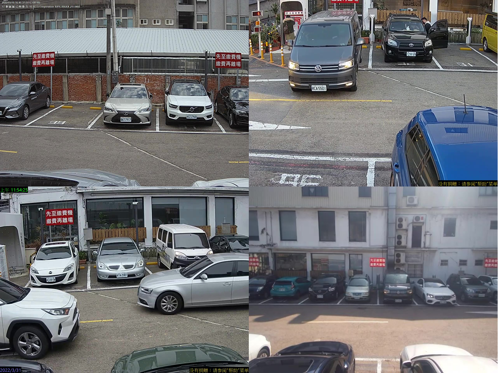
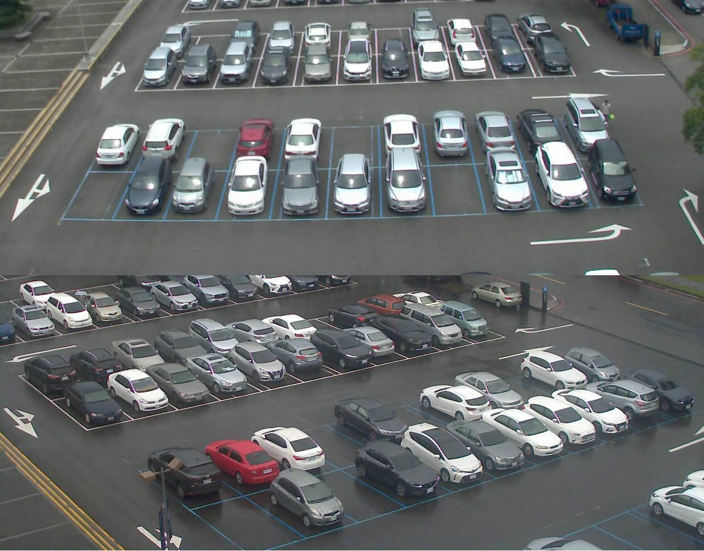
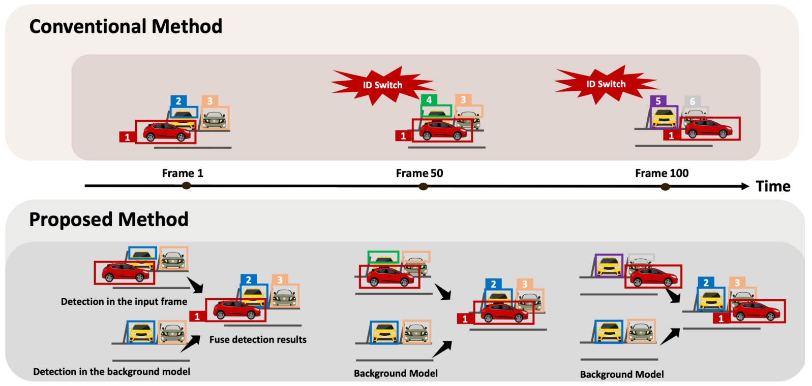
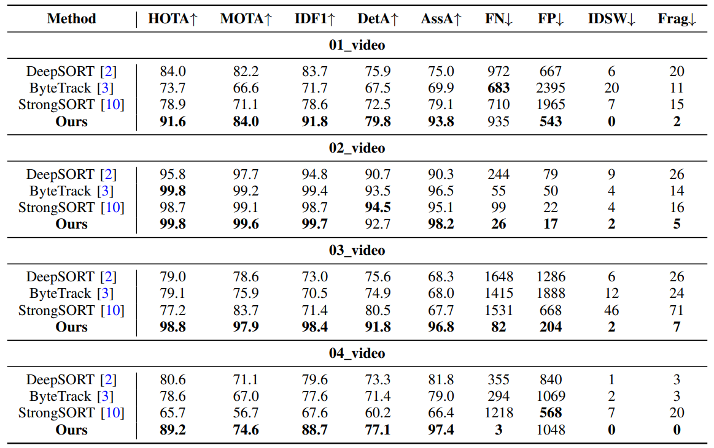
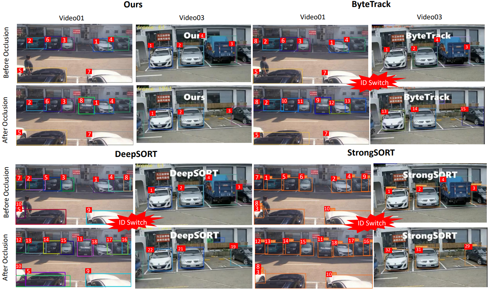

# Disentanglement-Based Multi-Vehicle Detection and Tracking for Gate-Free Parking Lot Management

This codebase contains the implementation of:

**[Disentanglement-Based Multi-Vehicle Detection and Tracking for Gate-Free Parking Lot Management](https://ieeexplore.ieee.org/document/10043379) (ICCE2023)**

## Altob&ACM Dataset
In cooperation with Altob, we propose our own dataset in this paper.

- **[Altob&ACM](https://drive.google.com/drive/folders/1QTrd_xDrLISX65myavIEDsmgeUsC3mzM?usp=sharing)**



- **[NYCU cam](https://drive.google.com/drive/folders/1uiysffXs0wamqfc8hmR9ZsGEb38e5xkt?usp=sharing)**



## Framework Overview
llustration of our tracker. The occluded cars that are originally parked in the spots remain in the tracklets in the
separated background model, hence we are able to recover those occluded objects and avoid ID switching cases dramatically.


## Abstract 
Multiple object tracking (MOT) techniques can help to build gate-free parking lot management systems purely under vision-based surveillance. However, conventional MOT methods tend to suffer long-term occlusion and cause ID switch problems, making applying them directly in crowded and complex parking lot scenes challenging. Hence, we present a novel disentanglement-based architecture for multi-object detection and tracking to relieve the ID switch issues. First, a background image is disentangled from the original input frame; then, MOT is applied separately to the background and original frames. Next, we design a fusion strategy that can solve the ID switch problem by keeping track of the occluded vehicles while considering complex interactions among vehicles. In addition, we provide a dataset with annotations in severe occlusions parking lot scenes that suits the application. The experiment results show our superiority over the state-of-the-art trackers quantitatively and qualitatively.
## Execution Step
```
# Using GMM to generate background video
python GMM.py --video ${VID_FILE} --output ${OUTPUT_PATH}

# Tracking with BG and FG videos
python demo1.py --model ${CKPT_FILE} --bg_source ${GMM_VID_FILE} --fg_source ${VID_FILE} --output ${OUTPUT_PATH}

# Tracking NYCU dataset
python demo_NYCU.py --model ${CKPT_FILE} --output ${OUTPUT_PATH} --camera ${CAM_INDEX}
```

- `fg_source`: Original video.
- `bg_source`: The output video of GMM.
- CKPT_FILE: Default is `./yolox_x.pth`
- CAM_INDEX: `0` or `1`. Two different angle webcams of NYCU parking lot.


## Experiments Results

### Main Results
Quantitative comparison with the state-of-the-art MOT methods in terms of different metrics. Here, the notation
(↑) indicates the higher is better. In contrast, the notation (↓) means the lower is better.


### Comparision with SOTA
Comparison of our method with DeepSORT, ByteTrack, and StrongSORT on the 01 video in Altob&ACM dataset (i.e.,
Video 1 and 3). We show the car tracking IDs (the white numbers) before and after long-term occlusion. Our method robustly
tracks cars with consistent IDs, while the other methods produce severe ID switch results.


<!--
# YOLOX_deepsort_tracker

<div align="center">
<p>
  
</p>
<br>
<div>

</div>

</div>

## :tada: How to use

### &#8627; Tracker example

```python
from tracker import Tracker

tracker = Tracker()    # instantiate Tracker

cap = cv2.VideoCapture('test.mp4')  # open one video

while True:
    _, im = cap.read() # read frame from video
    if im is None:
       break
    
    img_visual, bbox = tracker.update(img)  # feed one frame and get result
    
    cv2.imshow('demo', img_visual)	# imshow
    cv2.waitKey(1)
    if cv2.getWindowProperty('demo', cv2.WND_PROP_AUTOSIZE) < 1:
        break

cap.release()
cv2.destroyAllWindows()
```

Tracker uses YOLOX as detector to get each target's boundingbox, and use deepsort to get every bbox's ID.

### &#8627; Select specific category

If you just  want to track only some specific categories, you can set by param *filter_classes*.

For example:

```python
tracker = Tracker(filter_classes=['car','person']) 
```

## &#8627; Detector example

If you don't need tracking and just want to use YOLOX for object-detection, you can use the class **Detector** to inference easliy .

For example:

```python
from detector import Detector
import cv2
detector = Detector() # instantiate Detector

img = cv2.imread('YOLOX/assets/dog.jpg') 	# load image
result = detector.detect(img) 	# detect targets

img_visual = result['visual'] 	 # visualized image
cv2.imshow('detect', img_visual) # imshow
cv2.waitKey(0)
```

You can also get more information like *raw_img/boudingbox/score/class_id* from the result of detector.

## :art: Install

1. Clone the repository recursively:

   ```bash
   git clone --recurse-submodules https://github.com/pmj110119/YOLOX_deepsort_tracker.git
   ```

   If you already cloned and forgot to use `--recurse-submodules` you can run `git submodule update --init`(clone最新的YOLOX仓库)

2. Make sure that you fulfill all the requirements: Python 3.8 or later with all [requirements.txt](https://github.com/mikel-brostrom/Yolov5_DeepSort_Pytorch/blob/master/requirements.txt) dependencies installed, including torch>=1.7. To install, run:

   `pip install -r requirements.txt`


## :zap: Select a YOLOX family model

1. train your own model or just download pretrained models from https://github.com/Megvii-BaseDetection/YOLOX

   | Model                                       | size | mAP<sup>test<br>0.5:0.95 | Speed V100<br>(ms) | Params<br>(M) | FLOPs<br>(G) |                           weights                            |
   | ------------------------------------------- | :--: | :----------------------: | :----------------: | :-----------: | :----------: | :----------------------------------------------------------: |
   | [YOLOX-s](./exps/default/yolox_s.py)        | 640  |           39.6           |        9.8         |      9.0      |     26.8     | [onedrive](https://megvii-my.sharepoint.cn/:u:/g/personal/gezheng_megvii_com/EW62gmO2vnNNs5npxjzunVwB9p307qqygaCkXdTO88BLUg?e=NMTQYw)/[github](https://github.com/Megvii-BaseDetection/storage/releases/download/0.0.1/yolox_s.pth) |
   | [YOLOX-m](./exps/default/yolox_m.py)        | 640  |           46.4           |        12.3        |     25.3      |     73.8     | [onedrive](https://megvii-my.sharepoint.cn/:u:/g/personal/gezheng_megvii_com/ERMTP7VFqrVBrXKMU7Vl4TcBQs0SUeCT7kvc-JdIbej4tQ?e=1MDo9y)/[github](https://github.com/Megvii-BaseDetection/storage/releases/download/0.0.1/yolox_m.pth) |
   | [YOLOX-l](./exps/default/yolox_l.py)        | 640  |           50.0           |        14.5        |     54.2      |    155.6     | [onedrive](https://megvii-my.sharepoint.cn/:u:/g/personal/gezheng_megvii_com/EWA8w_IEOzBKvuueBqfaZh0BeoG5sVzR-XYbOJO4YlOkRw?e=wHWOBE)/[github](https://github.com/Megvii-BaseDetection/storage/releases/download/0.0.1/yolox_l.pth) |
   | [YOLOX-x](./exps/default/yolox_x.py)        | 640  |         **51.2**         |        17.3        |     99.1      |    281.9     | [onedrive](https://megvii-my.sharepoint.cn/:u:/g/personal/gezheng_megvii_com/EdgVPHBziOVBtGAXHfeHI5kBza0q9yyueMGdT0wXZfI1rQ?e=tABO5u)/[github](https://github.com/Megvii-BaseDetection/storage/releases/download/0.0.1/yolox_x.pth) |
   | [YOLOX-Darknet53](./exps/default/yolov3.py) | 640  |           47.4           |        11.1        |     63.7      |    185.3     | [onedrive](https://megvii-my.sharepoint.cn/:u:/g/personal/gezheng_megvii_com/EZ-MV1r_fMFPkPrNjvbJEMoBLOLAnXH-XKEB77w8LhXL6Q?e=mf6wOc)/[github](https://github.com/Megvii-BaseDetection/storage/releases/download/0.0.1/yolox_darknet53.pth) |

   Download **yolox_s.pth** to the folder **weights** , which is the default model path of **Tracker**.

2. You can also use other yolox models as detector,. For example:

   ```python
   """
   YOLO family: yolox-s, yolox-m, yolox-l, yolox-x, yolox-tiny, yolox-nano, yolov3
   """
   # yolox-s example
   detector = Tracker(model='yolox-s', ckpt='./yolox_s.pth')
   # yolox-m example
   detector = Tracker(model='yolox-m', ckpt='./yolox_m.pth')
   ```

##  :rose: Run demo

```python
python demo.py --path=test.mp4
```

-->
